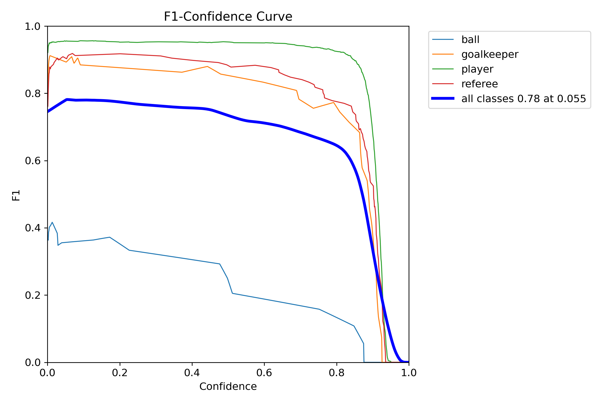
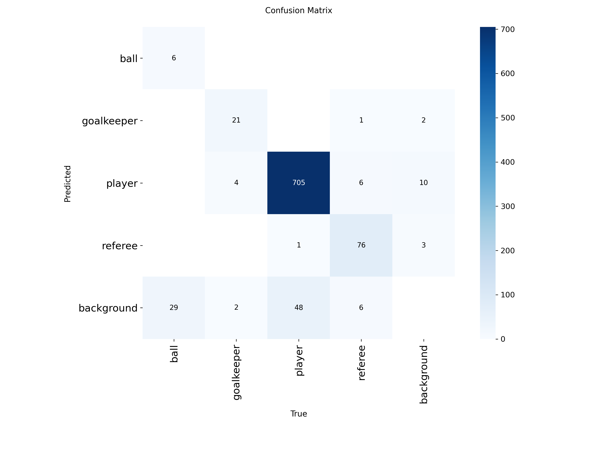

# Football-Tracking-and-Analysis-System

This project implements a **computer vision–powered football analysis pipeline**. I used the [Roboflow Playing Cards Dataset](https://universe.roboflow.com/roboflow-jvuqo/football-players-detection-3zvbc/dataset/1#) to train a YOLOv8 model combined with tracking, clustering, and motion estimation, the system processes full-game videos to generate **automated player tracking, team assignment, possession statistics, and movement insights**.  

---

## 1. Object Detection with YOLOv8  

A YOLOv8x model was trained to detect:  
- Players 👤  
- Goalkeepers 🧤  
- Referees 👨‍⚖️  
- Ball ⚽  

**Training Details**  
- Model: YOLOv8x  
- Confidence threshold: 0.1  
- Image size: 640x640  
- Hardware: NVIDIA A100 GPU  
- Achieved **94.2% precision**, **83% mAP50**

**Training Results**
| Class | Images | Instances | Precision (P) | F1 Confidence | mAP50 | mAP50-95 |
|-------|--------|-----------|---------------|---------------|-------|----------|
| all   | 38     | 905       | 94.2          | 95.3          | 0.83  | 0.60     |

📉 **Loss Curves**  
Here are the loss curves for training:

📉 **Loss Curves**  
Here is the f1 curve for training:

📊 **Confusion Matrix**  
Here is the confusion matrix:

---

## 2. Player Tracking with ByteTrack  

To maintain **consistent IDs across frames**, the detections are passed into [ByteTrack](https://github.com/ifzhang/ByteTrack).  
- Ensures robust multi-player tracking  
- Handles short occlusions and re-identification  
- IDs are later used for possession & movement calculations  

---

## 3. Team Assignment with K-Means Clustering  

Players are assigned to teams based on **jersey color clustering**:  
- Extracted jersey region from bounding box  
- Applied **K-Means (k=2)** to separate teams  
- Referees are excluded automatically  

---

## 4. Camera Motion Estimation  

To account for panning/zooming, we implemented an **optical flow–based camera stabilization module**:  
- Lucas-Kanade optical flow (OpenCV)  
- Filters out large player/object movements  
- Outputs per-frame camera shift `[dx, dy]`  
- Helps correct speed/distance measurements  

---

## 5. Speed & Distance Estimation  

- Player displacement calculated using a **5-frame sliding window**  
- Adjusted with camera movement estimator  
- Outputs real-world–scaled **speed (m/s)** and **distance covered**  

---

## 6. Output Visualization  

Final processed video includes:  
- Bounding boxes + IDs  
- Team colors  
- Ball possession indicator  
- Player movement trails  
- Speed/possession stats overlay  

### 🎥 Example Output  

---

## Technologies Used 🛠  
- **YOLOv8 (Ultralytics)** – Object detection  
- **ByteTrack (Supervision)** – Multi-object tracking  
- **OpenCV** – Frame processing, optical flow, perspective transforms  
- **NumPy / Pandas** – Data handling, interpolation  
- **Scikit-learn** – K-Means clustering 
